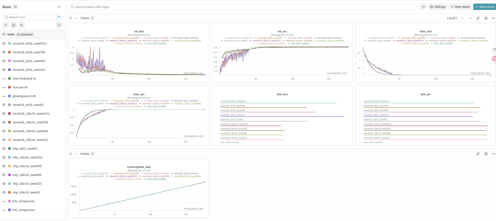
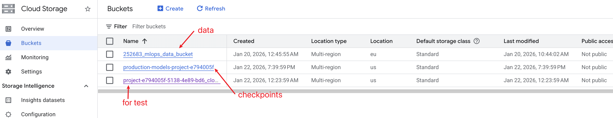
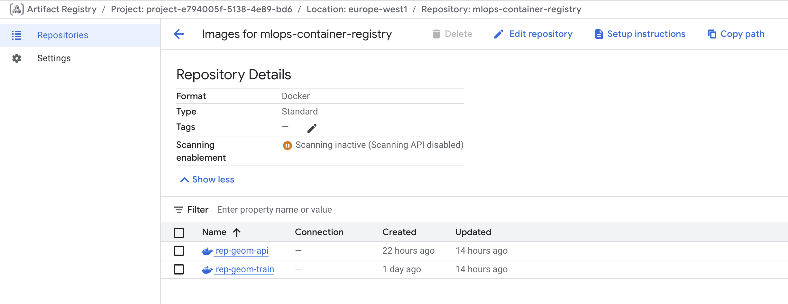
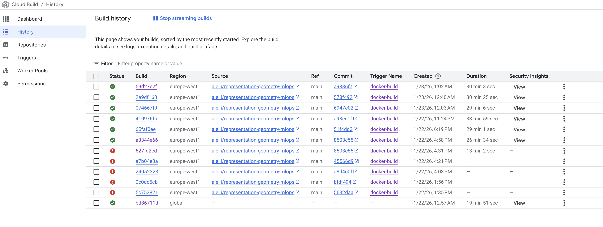
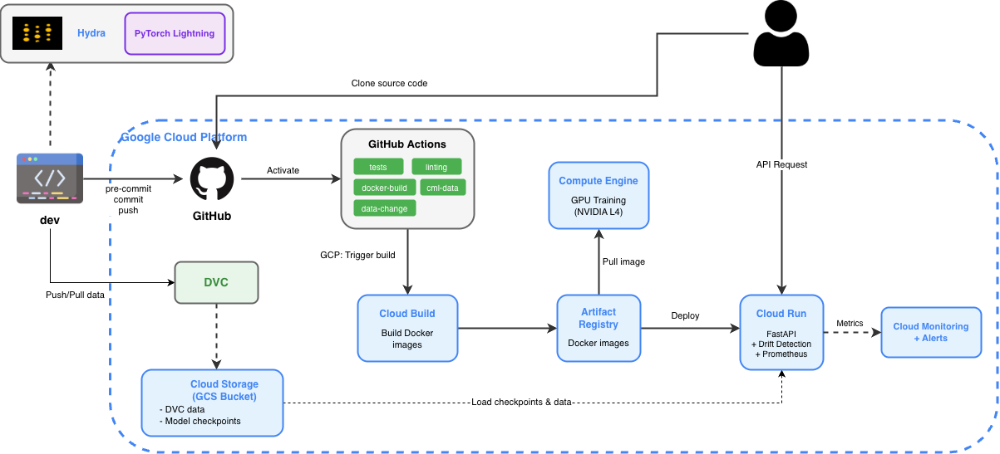

# Exam template for 02476 Machine Learning Operations

This is the report template for the exam. Please only remove the text formatted as with three dashes in front and behind
like:

```--- question 1 fill here ---```

Where you instead should add your answers. Any other changes may have unwanted consequences when your report is
auto-generated at the end of the course. For questions where you are asked to include images, start by adding the image
to the `figures` subfolder (please only use `.png`, `.jpg` or `.jpeg`) and then add the following code in your answer:

``

In addition to this markdown file, we also provide the `report.py` script that provides two utility functions:

Running:

```bash
python report.py html
```

Will generate a `.html` page of your report. After the deadline for answering this template, we will auto-scrape
everything in this `reports` folder and then use this utility to generate a `.html` page that will be your serve
as your final hand-in.

Running

```bash
python report.py check
```

Will check your answers in this template against the constraints listed for each question e.g. is your answer too
short, too long, or have you included an image when asked. For both functions to work you mustn't rename anything.
The script has two dependencies that can be installed with

```bash
pip install typer markdown
```

or

```bash
uv add typer markdown
```

## Overall project checklist

The checklist is *exhaustive* which means that it includes everything that you could do on the project included in the
curriculum in this course. Therefore, we do not expect at all that you have checked all boxes at the end of the project.
The parenthesis at the end indicates what module the bullet point is related to. Please be honest in your answers, we
will check the repositories and the code to verify your answers.

### Week 1

* [x] Create a git repository (M5)
* [x] Make sure that all team members have write access to the GitHub repository (M5)
* [x] Create a dedicated environment for you project to keep track of your packages (M2)
* [x] Create the initial file structure using cookiecutter with an appropriate template (M6)
* [x] Fill out the `data.py` file such that it downloads whatever data you need and preprocesses it (if necessary) (M6)
* [x] Add a model to `model.py` and a training procedure to `train.py` and get that running (M6)
* [x] Remember to either fill out the `requirements.txt`/`requirements_dev.txt` files or keeping your
    `pyproject.toml`/`uv.lock` up-to-date with whatever dependencies that you are using (M2+M6)
* [x] Remember to comply with good coding practices (`pep8`) while doing the project (M7)
* [x] Do a bit of code typing and remember to document essential parts of your code (M7)
* [x] Setup version control for your data or part of your data (M8)
* [x] Add command line interfaces and project commands to your code where it makes sense (M9)
* [x] Construct one or multiple docker files for your code (M10)
* [x] Build the docker files locally and make sure they work as intended (M10)
* [x] Write one or multiple configurations files for your experiments (M11)
* [x] Used Hydra to load the configurations and manage your hyperparameters (M11)
* [ ] Use profiling to optimize your code (M12)
* [x] Use logging to log important events in your code (M14)
* [x] Use Weights & Biases to log training progress and other important metrics/artifacts in your code (M14)
* [x] Consider running a hyperparameter optimization sweep (M14)
* [x] Use PyTorch-lightning (if applicable) to reduce the amount of boilerplate in your code (M15)

### Week 2

* [x] Write unit tests related to the data part of your code (M16)
* [x] Write unit tests related to model construction and or model training (M16)
* [x] Calculate the code coverage (M16)
* [x] Get some continuous integration running on the GitHub repository (M17)
* [x] Add caching and multi-os/python/pytorch testing to your continuous integration (M17)
  
* [x] Add a linting step to your continuous integration (M17)
* [x] Add pre-commit hooks to your version control setup (M18)
* [x] Add a continues workflow that triggers when data changes (M19)
* [x] Add a continues workflow that triggers when changes to the model registry is made (M19)
* [x] Create a data storage in GCP Bucket for your data and link this with your data version control setup (M21)
* [x] Create a trigger workflow for automatically building your docker images (M21)
* [x] Get your model training in GCP using either the Engine or Vertex AI (M21)
* [x] Create a FastAPI application that can do inference using your model (M22)
* [x] Deploy your model in GCP using either Functions or Run as the backend (M23)
* [x] Write API tests for your application and setup continues integration for these (M24)
* [x] Load test your application (M24)
* [ ] Create a more specialized ML-deployment API using either ONNX or BentoML, or both (M25)
* [ ] Create a frontend for your API (M26)

### Week 3

* [x] Check how robust your model is towards data drifting (M27)
* [x] Setup collection of input-output data from your deployed application (M27)
* [x] Deploy to the cloud a drift detection API (M27)
* [x] Instrument your API with a couple of system metrics (M28)
* [x] Setup cloud monitoring of your instrumented application (M28)
* [x] Create one or more alert systems in GCP to alert you if your app is not behaving correctly (M28)
* [ ] If applicable, optimize the performance of your data loading using distributed data loading (M29)
* [ ] If applicable, optimize the performance of your training pipeline by using distributed training (M30)
* [ ] Play around with quantization, compilation and pruning for you trained models to increase inference speed (M31)

### Extra

* [x] Write some documentation for your application (M32)
* [x] Publish the documentation to GitHub Pages (M32)
* [x] Revisit your initial project description. Did the project turn out as you wanted?
* [x] Create an architectural diagram over your MLOps pipeline
* [x] Make sure all group members have an understanding about all parts of the project
* [x] Uploaded all your code to GitHub

## Group information

### Question 1
> **Enter the group number you signed up on <learn.inside.dtu.dk>**
>
> Answer:

Group 73

### Question 2
> **Enter the study number for each member in the group**
>
> Example:
>
> *sXXXXXX, sXXXXXX, sXXXXXX*
>
> Answer:

s252683, just me

### Question 3
> **Did you end up using any open-source frameworks/packages not covered in the course during your project? If so**
> **which did you use and how did they help you complete the project?**
>
> Recommended answer length: 0-200 words.
>
> Example:
> *We used the third-party framework ... in our project. We used functionality ... and functionality ... from the*
> *package to do ... and ... in our project*.
>
> Answer:

We used PyTorch Lightning to reduce boilerplate training code and provide a structured training loop. 

## Coding environment

> In the following section we are interested in learning more about you local development environment. This includes
> how you managed dependencies, the structure of your code and how you managed code quality.

### Question 4

> **Explain how you managed dependencies in your project? Explain the process a new team member would have to go**
> **through to get an exact copy of your environment.**
>
> Recommended answer length: 100-200 words
>
> Example:
> *We used ... for managing our dependencies. The list of dependencies was auto-generated using ... . To get a*
> *complete copy of our development environment, one would have to run the following commands*
>
> Answer:

We used uv for managing our dependencies. The list of dependencies is defined in `pyproject.toml` and the exact versions are locked in `uv.lock` which is auto-generated by uv. To get a complete copy of our development environment, a new team member would need to:

1. Install uv: `curl -LsSf https://astral.sh/uv/install.sh | sh`
2. Clone the repository
3. Run `uv sync --dev` to install all dependencies with exact locked versions

For CUDA support on Linux, they would run:
```bash
uv sync --dev --reinstall --index pytorch-cuda=https://download.pytorch.org/whl/cu124
```

The project requires Python 3.12 (specified in `.python-version`). uv automatically creates and manages the virtual environment in `.venv/`.

### Question 5

> **We expect that you initialized your project using the cookiecutter template. Explain the overall structure of your**
> **code. What did you fill out? Did you deviate from the template in some way?**
>
> Recommended answer length: 100-200 words
>
> Example:
> *From the cookiecutter template we have filled out the ... , ... and ... folder. We have removed the ... folder*
> *because we did not use any ... in our project. We have added an ... folder that contains ... for running our*
> *experiments.*
>
> Answer:

From the cookiecutter template we have filled out the `src/representation_geometry/` folder with our core modules: `data.py` (data loading with PyTorch Lightning DataModules for CIFAR-10 and STL-10), `model.py` (MLPClassifier and ResNet18Classifier using Lightning), `train.py` (Hydra-based training script with W&B logging), `api.py` (FastAPI application), `drift.py` (Evidently-based drift detection), `evaluate.py`. We also use the `configs/` folder extensively with Hydra configuration files organized into subdirectories: `model/`, `data/`, `experiment/`, and `api/`. The `tests/` folder contains unit tests and performance tests including a Locust load testing file. We added a `dockerfiles/` folder (instead of a single Dockerfile) containing three Dockerfiles: `train.dockerfile`, `train-cuda.dockerfile`, and `api.dockerfile`. We also added `tasks.py` for invoke-based project commands.

### Question 6

> **Did you implement any rules for code quality and format? What about typing and documentation? Additionally,**
> **explain with your own words why these concepts matters in larger projects.**
>
> Recommended answer length: 100-200 words.
>
> Example:
> *We used ... for linting and ... for formatting. We also used ... for typing and ... for documentation. These*
> *concepts are important in larger projects because ... . For example, typing ...*
>
> Answer:

We used ruff for both linting and formatting, configured in `pyproject.toml` with a line length of 120 characters. Ruff is integrated as a pre-commit hook in `.pre-commit-config.yaml`, running both `ruff check --fix` and `ruff format` on every commit. We also have additional pre-commit hooks for trailing whitespace, end-of-file fixing, YAML/TOML/JSON validation, merge conflict detection, private key detection, and large file checking.

For typing, we used Python type hints throughout the codebase (e.g., `def get_datamodule(cfg: DictConfig) -> L.LightningDataModule`). For documentation, we added docstrings to all public functions and classes following Google-style format, describing arguments, return values, and functionality.

These concepts are important in larger projects because they ensure code consistency across team members, catch bugs early (type hints help IDEs and static analyzers), and make the codebase easier to understand and maintain. For example, typing helps new team members understand function signatures without reading the entire implementation, and linting prevents common errors like unused imports or undefined variables.

## Version control

> In the following section we are interested in how version control was used in your project during development to
> corporate and increase the quality of your code.

### Question 7

> **How many tests did you implement and what are they testing in your code?**
>
> Recommended answer length: 50-100 words.
>
> Example:
> *In total we have implemented X tests. Primarily we are testing ... and ... as these the most critical parts of our*
> *application but also ... .*
>
> Answer:

In total we have implemented 55 tests. We are primarily testing:
- Data modules (13 tests): Testing CIFAR10DataModule and STL10DataModule initialization, data preparation, setup for fit/test stages, dataloader creation, and image shapes.
- Model architectures (17 tests): Testing MLPClassifier and ResNet18Classifier initialization, forward passes with different batch sizes, gradient flow, hook registration for representation extraction, and optimizer configuration.
- API endpoints (15 tests): Testing health checks, root endpoint, model listing, prediction endpoints (with/without checkpoints), monitoring endpoints, drift detection, and Prometheus metrics.
- Drift detection (9 tests): Testing image feature extraction from PIL images, numpy arrays, and torch tensors, brightness/contrast calculations, drift report generation, and drift test suite with simulated drift.
- Model performance (1 test): Testing staged models from W&B registry.

### Question 8

> **What is the total code coverage (in percentage) of your code? If your code had a code coverage of 100% (or close**
> **to), would you still trust it to be error free? Explain you reasoning.**
>
> Recommended answer length: 100-200 words.
>
> Example:
> *The total code coverage of code is X%, which includes all our source code. We are far from 100% coverage of our **
> *code and even if we were then...*
>
> Answer:

--- question 8 fill here ---

The total code coverage of our project is 31%, measured across the `src/representation_geometry` package. Coverage is unevenly distributed across modules: core components such as `data.py` (81%) and `model.py` (69%) are relatively well covered, while orchestration-heavy modules like `train.py`, `evaluate.py`, `registry.py`, and `utils.py` currently have low or zero coverage. The FastAPI application (`api.py`) and drift detection logic (`drift.py`) have partial coverage.

Even if the code coverage were close to 100%, we would not consider the system error-free. Code coverage only indicates which lines were executed during testing, not whether they were tested with meaningful assertions or realistic inputs. It does not guarantee correctness of outputs, robustness to edge cases, or proper behavior under real production conditions. In particular, integration issues between components, performance bottlenecks, and failures caused by real-world data distributions or cloud environments are not captured by unit tests alone. Therefore, coverage should be interpreted as one quality signal among many, complemented by integration tests, monitoring, and production observability.

### Question 9

> **Did you workflow include using branches and pull requests? If yes, explain how. If not, explain how branches and**
> **pull request can help improve version control.**
>
> Recommended answer length: 100-200 words.
>
> Example:
> *We made use of both branches and PRs in our project. In our group, each member had an branch that they worked on in*
> *addition to the main branch. To merge code we ...*
>
> Answer:

--- question 9 fill here ---

We made use of both branches and PRs in our project. The main branch is protected that no one could push directly. For each new feature or bugfix, we created a feature branch from main (e.g., feat/add-drift-detection). After implementing and testing locally, we opened a pull request. The CI pipeline (tests, linting, docker builds) ran automatically on the PR. Once all checks passed, we merged to main.

In summary, the workflow was:

1. We checked out a new branch from `main`.
2. We developed and tested the changes locally.
3. We committed, pushed, and opened a pull request while waiting for CI to pass.
4. After merging, we returned to `main`, pulled the latest changes, and deleted the merged branch.

Although we were working alone, we often had multiple branches active at the same time for different features or fixes. In these situations, we frequently rebased our branches onto the updated `main` branch after merges and resolved conflicts early to keep the repository clean and consistent.

### Question 10

> **Did you use DVC for managing data in your project? If yes, then how did it improve your project to have version**
> **control of your data. If no, explain a case where it would be beneficial to have version control of your data.**
>
> Recommended answer length: 100-200 words.
>
> Example:
> *We did make use of DVC in the following way: ... . In the end it helped us in ... for controlling ... part of our*
> *pipeline*
>
> Answer:

We did make use of DVC in the following way: Our `.dvc/config` file configures a remote storage backend using Google Cloud Storage with version awareness enabled. The `data/raw.dvc` file tracks our raw dataset files. DVC allows us to version control large data files without committing them to Git, while still maintaining reproducibility.

When data changes, our GitHub Actions workflow (`data-change.yaml`) automatically triggers on changes to `data/**`, `.dvc/**`, or `.dvcignore` files, running `dvc doctor` and `dvc status` to verify the DVC configuration. We also have a CML workflow (`cml-data.yaml`) that generates a dataset statistics report as a PR comment when data-related files change.

This setup allowed us to keep large data files out of Git while still tracking their versions and ensuring reproducibility. Although the raw datasets (CIFAR-10 and STL-10) did not change during the project, we kept DVC integrated because the data may change or be extended in the future.

### Question 11

> **Discuss you continuous integration setup. What kind of continuous integration are you running (unittesting,**
> **linting, etc.)? Do you test multiple operating systems, Python  version etc. Do you make use of caching? Feel free**
> **to insert a link to one of your GitHub actions workflow.**
>
> Recommended answer length: 200-300 words.
>
> Example:
> *We have organized our continuous integration into 3 separate files: one for doing ..., one for running ... testing*
> *and one for running ... . In particular for our ..., we used ... .An example of a triggered workflow can be seen*
> *here: <weblink>*
>
> Answer:

We have organized our continuous integration into 7 separate workflow files in `.github/workflows/`:

1. tests.yaml: Runs unit tests with pytest and coverage on every PR to main. Tests run on a matrix of three operating systems (ubuntu-latest, windows-latest, macos-latest) with Python 3.12. We use caching via `astral-sh/setup-uv@v7` with `enable-cache: true` based on `uv.lock` and `pyproject.toml`. Coverage results are uploaded as artifacts.

2. linting.yaml: Runs ruff check and ruff format on every push/PR to main. Uses caching for dependencies.

3. docker-build.yaml: Builds training and API Docker images on push/PR when `dockerfiles/**`, `src/**`, `pyproject.toml`, or `uv.lock` change. Uses Docker Buildx with GitHub Actions cache (`cache-from: type=gha`, `cache-to: type=gha,mode=max`).

4. data-change.yaml: Runs DVC doctor and status checks when data or DVC files change.

5. cml-data.yaml: Generates dataset statistics reports as PR comments using CML when data files change.

6. model-registry-change.yaml: Triggered by `repository_dispatch` when a model is staged in W&B registry, runs model tests, and adds production alias.

7. pre-commit-update.yaml and dependabot.yaml: Automated dependency updates.

All workflows use concurrency groups to cancel in-progress runs on new pushes.

## Running code and tracking experiments

> In the following section we are interested in learning more about the experimental setup for running your code and
> especially the reproducibility of your experiments.

### Question 12

> **How did you configure experiments? Did you make use of config files? Explain with coding examples of how you would**
> **run a experiment.**
>
> Recommended answer length: 50-100 words.
>
> Example:
> *We used a simple argparser, that worked in the following way: Python  my_script.py --lr 1e-3 --batch_size 25*
>
> Answer:

We used Hydra for configuration management with a hierarchical YAML structure in `configs/`. To run an experiment:

```bash
# Basic training with defaults (MLP on CIFAR-10)
uv run rep-geom-train

# Override model and dataset
uv run rep-geom-train model=resnet18 data=stl10

# Use a predefined experiment config
uv run rep-geom-train experiment=baseline_resnet18_cifar10

# Multi-run sweep across models, datasets, and seeds
uv run rep-geom-train -m model=mlp,resnet18 data=cifar10,stl10 seed=42,123,456
```

Configuration files are organized into `configs/model/` (mlp.yaml, resnet18.yaml), `configs/data/` (cifar10.yaml, stl10.yaml), and `configs/experiment/` for predefined experiment combinations.

### Question 13

> **Reproducibility of experiments are important. Related to the last question, how did you secure that no information**
> **is lost when running experiments and that your experiments are reproducible?**
>
> Recommended answer length: 100-200 words.
>
> Example:
> *We made use of config files. Whenever an experiment is run the following happens: ... . To reproduce an experiment*
> *one would have to do ...*
>
> Answer:

We made use of config files and several mechanisms to ensure reproducibility:

1. Hydra output directories: Each run creates a timestamped directory (`outputs/{date}/{time}/`) containing all outputs, logs, and a copy of the resolved configuration (`config_seed{X}.yaml`).

2. Random seeds: We set `seed` in the config (default: 42) and call `L.seed_everything(cfg.seed, workers=True)` in training, plus `deterministic=True` in the Lightning Trainer.

3. W&B logging: All hyperparameters are logged to Weights & Biases with the full resolved configuration (`OmegaConf.to_container(cfg)`), experiment tags, and notes.

4. Dependency locking: `uv.lock` ensures exact package versions are reproducible.

5. Model checkpoints: Saved with seed and metrics in the filename (e.g., `mlp_cifar10_seed42_epoch05_val_loss0.123.ckpt`).

To reproduce an experiment, one would load the saved config file and run `uv run rep-geom-train --config-dir /path/to/saved/config --config-name config_seed42` or manually set the same hyperparameters from W&B.

### Question 14

> **Upload 1 to 3 screenshots that show the experiments that you have done in W&B (or another experiment tracking**
> **service of your choice). This may include loss graphs, logged images, hyperparameter sweeps etc. You can take**
> **inspiration from [this figure](figures/wandb.png). Explain what metrics you are tracking and why they are**
> **important.**
>
> Recommended answer length: 200-300 words + 1 to 3 screenshots.
>
> Example:
> *As seen in the first image when have tracked ... and ... which both inform us about ... in our experiments.*
> *As seen in the second image we are also tracking ... and ...*
>
> Answer:

--- question 14 fill here ---



The screenshots show multiple experiment runs tracked in Weights & Biases across different random seeds and datasets (CIFAR-10 and STL-10), mainly using ResNet-18. We logged **training loss**, **validation loss**, **training accuracy**, and **validation accuracy** to monitor training behavior and ensure that the models converged correctly.

From the loss curves, we can see that training loss decreases steadily and converges smoothly across all runs. Validation loss follows a similar trend and stabilizes after several thousand training steps, which indicates that the models are not severely overfitting. The consistency of these curves across different random seeds suggests that the training process is stable and reproducible.

We also tracked training and validation accuracy. Both metrics increase rapidly during the early stages of training and then gradually plateau. Validation accuracy remains close to training accuracy, which further supports that the models generalize reasonably well. Tracking both accuracy and loss helps us detect issues such as unstable training, divergence, or large generalization gaps.

In addition to step-wise metrics, we logged **test loss** and **test accuracy** as summary metrics for each run. These values make it easy to compare different runs, datasets, and seeds in a single view. While absolute classification performance is not the main focus of this project, these metrics serve as a sanity check that the trained models behave as expected.

Overall, logging these metrics in W&B allowed us to monitor experiments in real time, compare runs efficiently, and ensure that the learned representations are based on stable and well-trained models before performing further analysis.

### Question 15

> **Docker is an important tool for creating containerized applications. Explain how you used docker in your**
> **experiments/project? Include how you would run your docker images and include a link to one of your docker files.**
>
> Recommended answer length: 100-200 words.
>
> Example:
> *For our project we developed several images: one for training, inference and deployment. For example to run the*
> *training docker image: `docker run trainer:latest lr=1e-3 batch_size=64`. Link to docker file: <weblink>*
>
> Answer:

For our project we developed three Docker images:

1. train.dockerfile: CPU training image using `ghcr.io/astral-sh/uv:python3.12-bookworm-slim` base.
2. train-cuda.dockerfile: GPU training image based on `nvidia/cuda:12.4.1-runtime-ubuntu22.04` with CUDA 12.4 support.
3. api.dockerfile: FastAPI inference server with drift monitoring and Prometheus metrics.

We use invoke (`tasks.py`) to simplify Docker operations. To build all images:

```bash
uv run invoke docker-build          # Build CPU train + API images
uv run invoke docker-build --cuda   # Also build CUDA image
```

To run training experiments in Docker containers:

```bash
uv run invoke docker-baseline-resnet18-cifar10   # Train ResNet-18 on CIFAR-10
uv run invoke docker-baseline-mlp-stl10          # Train MLP on STL-10
uv run invoke docker-full-comparison             # Multi-seed sweep across all models/datasets
```

These invoke tasks automatically mount `data/` and `outputs/` volumes, pass W&B environment variables, and enable GPU access. For example, `uv run invoke docker-baseline-resnet18-cifar10` runs:

```bash
docker run -d --gpus all -e WANDB_API_KEY -e WANDB_ENTITY -e WANDB_PROJECT \
  -v $(pwd)/data:/app/data -v $(pwd)/outputs:/app/outputs \
  rep-geom-train:cuda experiment=baseline_resnet18_cifar10
```

### Question 16

> **When running into bugs while trying to run your experiments, how did you perform debugging? Additionally, did you**
> **try to prof16ile your code or do you think it is already perfect?**
>
> Recommended answer length: 100-200 words.
>
> Example:
> *Debugging method was dependent on group member. Some just used ... and others used ... . We did a single profiling*
> *run of our main code at some point that showed ...*
>
> Answer:

--- question 16 fill here ---

When we ran into bugs during the project, we mainly used logging and simple print statements to understand what was going wrong. We relied on logs from Python’s `logging` module as well as messages from frameworks like Hydra, PyTorch Lightning, FastAPI, and Weights & Biases. These logs helped us check whether configurations were loaded correctly, models were initialized as expected, and data was flowing through the system properly.

For API-related issues, we usually reproduced the problem locally and looked at FastAPI error messages and request logs. When working in the cloud, checking Cloud Run logs was especially useful for debugging deployment and configuration problems.

We did not do explicit profiling in this project. The models we used are relatively small, and performance was not the main focus. The goal of this project is to investigate the geometric stability of internal neural network representations across multiple training runs with different random seeds, rather than to optimize training speed or inference latency. As long as the models trained correctly and consistently, performance was sufficient for our analysis.

If this project were extended further or used in a real production setting, profiling would become more important. In that case, we would measure inference latency (p99), memory usage, and throughput to find bottlenecks and improve efficiency. For this project, however, we focused on correctness, reproducibility, and stable representations rather than performance optimization.

## Working in the cloud

> In the following section we would like to know more about your experience when developing in the cloud.

### Question 17

> **List all the GCP services that you made use of in your project and shortly explain what each service does?**
>
> Recommended answer length: 50-200 words.
>
> Example:
> *We used the following two services: Engine and Bucket. Engine is used for... and Bucket is used for...*
>
> Answer:

We used the following GCP services in our project:

1. Cloud Storage (GCS Bucket): We used Cloud Storage as centralized storage for the project. It was mainly used as a remote backend for DVC to manage dataset versions and to store trained model checkpoints so they could be reused for evaluation and deployment.
2. Artifact Registry: Stores our Docker images (rep-geom-train, rep-geom-train-cuda, rep-geom-api) in the `europe-west1` region. Configured in `cloudbuild.yaml` to push images with tags.
3. Cloud Build: Automatically builds Docker images based on `cloudbuild.yaml` configuration when triggered. Builds all three images (train-cpu, train-cuda, api) in parallel.
4. Cloud Run: Deploys our FastAPI application as a serverless container. Configured with 2GB memory, 1 CPU, 1-2 instances, and environment variables for prediction logging and drift monitoring.
5. Compute Engine: We used Compute Engine to train our models on a VM instance with GPU support. The instance was configured with one NVIDIA L4 GPU and a `g2-standard-4` machine type (4 vCPUs and 16 GB memory).
6. Monitoring: We used Prometheus to collect system and application metrics from the deployed API, such as request counts and prediction latency (e.g. `api_requests_total` and `prediction_latency_seconds`).

### Question 18

> **The backbone of GCP is the Compute engine. Explained how you made use of this service and what type of VMs**
> **you used?**
>
> Recommended answer length: 100-200 words.
>
> Example:
> *We used the compute engine to run our ... . We used instances with the following hardware: ... and we started the*
> *using a custom container: ...*
>
> Answer:

We used Compute Engine to train our models on a VM instance with GPU support. The instance was configured with one NVIDIA L4 GPU and a `g2-standard-4` machine type (4 vCPUs and 16 GB memory).

To set up training, we manually created the VM instance through the GCP console and connected to it via SSH. On the instance, we cloned the repository, installed dependencies, and built the CUDA Docker image using `uv run invoke docker-build --cuda`. We then ran training experiments in detached containers using invoke commands such as:

```bash
uv run invoke docker-baseline-resnet18-cifar10
```

This command starts a Docker container with GPU access, mounts the data and output directories, and passes W&B credentials as environment variables. During training, we monitored progress through Weights & Biases and checked container logs with `docker logs`. After training completed, we retrieved the model checkpoints from the output directory and uploaded them to Cloud Storage for later use in the API. 

### Question 19

> **Insert 1-2 images of your GCP bucket, such that we can see what data you have stored in it.**
> **You can take inspiration from [this figure](figures/bucket.png).**
>
> Answer:

--- question 19 fill here ---



We used GCP bucket to mainly store data and checkpoints.

### Question 20

> **Upload 1-2 images of your GCP artifact registry, such that we can see the different docker images that you have**
> **stored. You can take inspiration from [this figure](figures/registry.png).**
>
> Answer:

--- question 20 fill here ---



We have two images, and build two tags of train images (cuda and cpu)

### Question 21

> **Upload 1-2 images of your GCP cloud build history, so we can see the history of the images that have been build in**
> **your project. You can take inspiration from [this figure](figures/build.png).**
>
> Answer:

--- question 21 fill here ---



### Question 22

> **Did you manage to train your model in the cloud using either the Engine or Vertex AI? If yes, explain how you did**
> **it. If not, describe why.**
>
> Recommended answer length: 100-200 words.
>
> Example:
> *We managed to train our model in the cloud using the Engine. We did this by ... . The reason we choose the Engine*
> *was because ...*
>
> Answer:

We managed to train our models in the cloud using Compute Engine. We chose Compute Engine instead of Vertex AI mainly because we were more familiar with working directly on VM instances. Using Compute Engine allowed us to reuse our existing Docker-based workflow and run training with the same invoke commands we used locally, without needing to adapt to Vertex AI’s job submission format.

The training process worked smoothly. We ran multiple experiments with different random seeds across CIFAR-10 and STL-10 datasets using both MLP and ResNet-18 architectures. All training metrics were logged to W&B, and the resulting checkpoints were saved to Cloud Storage for deployment. The GPU-accelerated training was significantly faster than local CPU training, which allowed us to complete the full comparison experiments in a reasonable time.

## Deployment

### Question 23

> **Did you manage to write an API for your model? If yes, explain how you did it and if you did anything special. If**
> **not, explain how you would do it.**
>
> Recommended answer length: 100-200 words.
>
> Example:
> *We did manage to write an API for our model. We used FastAPI to do this. We did this by ... . We also added ...*
> *to the API to make it more ...*
>
> Answer:

We did manage to write an API for our model using FastAPI. The API is implemented in `src/representation_geometry/api.py` and includes:

- `/health`: Health check endpoint returning device info and loaded models
- `/predict`: Main inference endpoint accepting base64-encoded images, returning predicted class, label, confidence, and top-k probabilities
- `/representations`: Extracts intermediate layer activations for representation analysis
- `/models`: Lists available model checkpoints
- `/predictions/stats`: Returns statistics about logged predictions
- `/monitoring/drift`: Compares recent predictions against reference data using Evidently for drift detection
- `/monitoring/health`: Health check for monitoring functionality
- `/metrics`: Prometheus metrics endpoint for scraping

Special features include: automatic model discovery from configurable paths, caching of loaded models, background prediction logging to CSV for drift detection, configurable normalization based on dataset, and Prometheus metrics middleware for request/latency tracking.

### Question 24

> **Did you manage to deploy your API, either in locally or cloud? If not, describe why. If yes, describe how and**
> **preferably how you invoke your deployed service?**
>
> Recommended answer length: 100-200 words.
>
> Example:
> *For deployment we wrapped our model into application using ... . We first tried locally serving the model, which*
> *worked. Afterwards we deployed it in the cloud, using ... . To invoke the service an user would call*
> *`curl -X POST -F "file=@file.json"<weburl>`*
>
> Answer:

For deployment, we wrapped our model into a FastAPI application containerized with Docker. We can serve it both locally and cloud with:
```bash
uv run uvicorn representation_geometry.api:app --host 0.0.0.0 --port 8000 --log-config configs/api/logging.conf --access-log
```

As we mentioned before, we deployed our api service in the cloud run with one instance.

To invoke the deployed service, a user would call:

```bash
# SERVICE_URL = https://rep-geom-api-848604577119.europe-west1.run.app
# Health check
curl https://SERVICE_URL/health

# Make prediction
curl -X POST https://SERVICE_URL/predict \
  -H "Content-Type: application/json" \
  -d '{"image_base64": "BASE64_ENCODED_IMAGE", "dataset": "cifar10"}'

# Check drift
curl -X POST https://SERVICE_URL/monitoring/drift \
  -H "Content-Type: application/json" \
  -d '{"dataset": "cifar10", "n_latest": 50}'
```

### Question 25

> **Did you perform any unit testing and load testing of your API? If yes, explain how you did it and what results for**
> **the load testing did you get. If not, explain how you would do it.**
>
> Recommended answer length: 100-200 words.
>
> Example:
> *For unit testing we used ... and for load testing we used ... . The results of the load testing showed that ...*
> *before the service crashed.*
>
> Answer:

For unit testing, we used pytest with 15 API tests in `tests/test_api.py` covering health endpoints, model listing, prediction endpoints (with and without checkpoints), monitoring endpoints, and Prometheus metrics. These tests use FastAPI's TestClient for synchronous testing.

For load testing, we used Locust with an extensive test suite in `tests/performancetests/locustfile.py`. We implemented three user types:
- APIUser: Simulates realistic usage with weighted tasks (health checks 10x, predictions 5x, representations 3x)
- LightweightUser: Tests only GET endpoints for availability testing
- InferenceUser: Focuses on inference endpoints for model performance testing

The Locust tests use real images from CIFAR-10/STL-10 test datasets (when available) via an ImagePool class that preloads and caches base64-encoded images.

To run load tests:
```bash
locust -f tests/performancetests/locustfile.py --host http://localhost:8000 --headless -u 10 -r 2 -t 60s
```

### Question 26

> **Did you manage to implement monitoring of your deployed model? If yes, explain how it works. If not, explain how**
> **monitoring would help the longevity of your application.**
>
> Recommended answer length: 100-200 words.
>
> Example:
> *We did not manage to implement monitoring. We would like to have monitoring implemented such that over time we could*
> *measure ... and ... that would inform us about this ... behaviour of our application.*
>
> Answer:

We did implement monitoring for our deployed model using several components.

First, we exposed Prometheus metrics through a `/metrics` endpoint in the API. We logged custom metrics such as request latency, inference latency, and prediction confidence. For example, histograms were used to track API request latency and prediction latency, which helped us understand the performance behavior of the service over time.

Second, we implemented data drift detection. For each prediction, we logged extracted image features (such as brightness, contrast, color statistics, sharpness, and saturation) to a CSV-based storage. The `/monitoring/drift` endpoint uses Evidently to compare recent prediction data with a reference dataset and report whether data drift is detected.

Finally, we integrated GCP Cloud Monitoring on top of these metrics. We set up an alert for high latency on the prediction endpoint, triggering when the p99 latency exceeded 50 ms. This allows us to quickly detect performance issues and react before they affect users.

## Overall discussion of project

> In the following section we would like you to think about the general structure of your project.

### Question 27

> **How many credits did you end up using during the project and what service was most expensive? In general what do**
> **you think about working in the cloud?**
>
> Recommended answer length: 100-200 words.
>
> Example:
> *Group member 1 used ..., Group member 2 used ..., in total ... credits was spend during development. The service*
> *costing the most was ... due to ... . Working in the cloud was ...*
>
> Answer:

--- question 27 fill here ---

As a solo developer, I used approximately $33 in cloud credits during the project. The most expensive service was Compute Engine, mainly due to running GPU instances for model training.

Overall, working in the cloud was convenient and flexible for several reasons:

1. I could access GPU resources whenever needed, without maintaining my own hardware.
2. I could deploy my API service using cloud instances and scale it to multiple instances for load balancing, smooth upgrades, and basic fault tolerance.
3. I could add custom metrics to my code and monitor the system in real time to understand the status and behavior of the application.
4. I could set up alerts based on these metrics to get notified quickly when something went wrong. For example, if the number of requests suddenly increased, I could scale the service manually or automatically.
5. I could build an automated pipeline that connects development, training, deployment, and monitoring in a single cloud-based workflow.

### Question 28

> **Did you implement anything extra in your project that is not covered by other questions? Maybe you implemented**
> **a frontend for your API, use extra version control features, a drift detection service, a kubernetes cluster etc.**
> **If yes, explain what you did and why.**
>
> Recommended answer length: 0-200 words.
>
> Example:
> *We implemented a frontend for our API. We did this because we wanted to show the user ... . The frontend was*
> *implemented using ...*
>
> Answer:

We implemented Drift Detection Service: A complete data drift monitoring system using Evidently. The API logs image features with every prediction (brightness, contrast, color statistics, sharpness, saturation) to a CSV database. The `/monitoring/drift` endpoint compares these against reference datasets and generates HTML reports. CLI commands (`rep-geom-drift check`, `simulate-drift`, `generate-reference`) allow offline drift analysis.

### Question 29

> **Include a figure that describes the overall architecture of your system and what services that you make use of.**
> **You can take inspiration from [this figure](figures/overview.png). Additionally, in your own words, explain the**
> **overall steps in figure.**
>
> Recommended answer length: 200-400 words
>
> Example:
>
> *The starting point of the diagram is our local setup, where we integrated ... and ... and ... into our code.*
> *Whenever we commit code and push to GitHub, it auto triggers ... and ... . From there the diagram shows ...*
>
> Answer:



The starting point is local development (dev) where we write code using PyTorch Lightning and Hydra for configuration management. Pre-commit hooks run ruff for linting on every commit. When we push to GitHub, CI workflows (GitHub Actions) automatically run tests across 3 operating systems, linting checks, docker builds, and data change verification.

Data is versioned with DVC and stored in Google Cloud Storage (GCS bucket). When CI triggers a docker build, Cloud Build creates three Docker images (train, train-cuda, api) and pushes them to Artifact Registry.

For training, we pull the CUDA Docker image to a Compute Engine VM with NVIDIA L4 GPU. Training metrics and hyperparameters are logged to W&B with Hydra configurations. Model checkpoints are saved to GCS.

The API Docker image is deployed to Cloud Run as a serverless container. The FastAPI application includes drift detection using Evidently (comparing production predictions against reference datasets) and exposes Prometheus metrics. Cloud Monitoring collects these metrics and can trigger alerts for high latency or errors.

Users can clone the source code from GitHub and query the deployed API service for predictions. The API loads model checkpoints from GCS and returns classification results with confidence scores.

### Question 30

> **Discuss the overall struggles of the project. Where did you spend most time and what did you do to overcome these**
> **challenges?**
>
> Recommended answer length: 200-400 words.
>
> Example:
> *The biggest challenges in the project was using ... tool to do ... . The reason for this was ...*
>
> Answer:

--- question 30 fill here ---

There were several challenges during this project, and most of them were related to learning new tools and working in the cloud.

1. I spent a lot of time getting familiar with GCP. Many services require correct permissions, and small misconfigurations can easily break the pipeline. I often had to double-check IAM roles, service accounts, and access settings before things worked as expected.
2. It also took significant time to understand how to correctly create VM instances and run my API Docker containers in the cloud. Compared to local development, debugging cloud deployments required more trial and error.
3. One particularly time-consuming issue was debugging why monitoring metrics were not showing up. My API service was configured to run on port 8000, but the default monitoring sidecar scraped metrics from port 8080 at the `/metrics` endpoint. This mismatch caused all metrics to be missing. I eventually solved this by creating a custom Cloud Run monitoring configuration that correctly scraped metrics from port 8000.
4. Another challenge was the sheer amount of information involved. The project required learning and combining many frameworks and tools, such as GCP services, FastAPI, monitoring tools, and experiment tracking. Understanding how these pieces fit together took time.

To overcome these challenges, I relied heavily on iterative debugging, reading documentation, and experimenting with small changes. I also made extensive use of generative AI tools to help understand concepts, debug errors, and guide me through GCP operations. These tools significantly reduced the learning curve and helped me move forward when I got stuck.

### Question 31

> **State the individual contributions of each team member. This is required information from DTU, because we need to**
> **make sure all members contributed actively to the project. Additionally, state if/how you have used generative AI**
> **tools in your project.**
>
> Recommended answer length: 50-300 words.
>
> Example:
> *Student sXXXXXX was in charge of developing of setting up the initial cookie cutter project and developing of the*
> *docker containers for training our applications.*
> *Student sXXXXXX was in charge of training our models in the cloud and deploying them afterwards.*
> *All members contributed to code by...*
> *We have used ChatGPT to help debug our code. Additionally, we used GitHub Copilot to help write some of our code.*
> Answer:

--- question 31 fill here ---

- As a solo developer (s252683), I was responsible for all aspects of the project. I used generative AI tools (ChatGPT, Cursor, and Codex) to help with:

  - Generating code and documentation examples
  - Debugging issues and fixing errors
  - Understanding course concepts and related frameworks
  - Polishing and correcting the grammar of the report

  All AI-generated content was reviewed and adapted before being used in the project.
